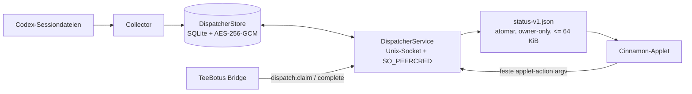

# Architektur des History-Dispatchers

**Stand:** 28. Juli 2026  
**Basiskommit:** `8f0bb05a540942e61c979a51bbaeca32d4308eb1`  
**Vertragsstatus:** eingefrorene v1-Baseline für den schrittweisen Ausbau

Dieses Dokument beschreibt zuerst den tatsächlich vorhandenen Stand. Die v2-Zielarchitektur wird nur dort genannt, wo eine bereits akzeptierte Architekturentscheidung die Richtung festlegt. Dadurch bleibt jederzeit erkennbar, welche Garantien heute gelten und welche erst in späteren Implementierungsschnitten entstehen.

## 1. Komponenten und Fehlerdomänen

| Komponente | Aufgabe im v1-Stand | Vertrauensgrenze | Eigenständige Fehlerdomäne |
|---|---|---|---|
| `Collector` | Liest konfigurierte Codex-Sessionquellen und hängt normalisierte History-Einträge an. | Lokale Sessiondateien → verschlüsselter Store | Ja; periodischer systemd-User-Oneshot |
| `DispatcherService` | Stellt die versionierte Control-API über einen owner-only Unix-Socket bereit. | Same-User-Client → Store/Operation-Allowlist | Ja; langlebiger systemd-User-Dienst |
| `DispatcherStore` | Hält Queue, Recipient-Ergebnisse, Audit und verschlüsselte Payloads in SQLite. | Service/Collector → lokale Zustandsdatei | Innerhalb des Dienstes, aber unabhängig vom Applet |
| Status-Writer | Erzeugt atomar `status-v1.json` mit maximal 64 KiB und ohne Payloads. | Store/Service → redigierte Desktopansicht | Ein Fehler darf die Datenbank nicht ersetzen oder entschlüsseln |
| Cinnamon-Applet | Liest ausschließlich den Snapshot und ruft feste `applet-action`-Operationen auf. | Redigierter Snapshot/CLI → Cinnamon UI | Ja; Entfernung oder Absturz darf Backendprozesse nicht stoppen |
| TeeBotus | Kann im Bridge-Modus claimen, Messengerzustellungen ausführen und Ergebnisse zurückmelden. | Dispatcher-Claim → Messengeradapter | Externes Repository und eigener Prozess |

## 2. Tatsächlicher v1-Datenfluss

## 3. Zentrale Sicherheitsgrenzen

1. **Kein IP-Listener.** Die Control-API basiert auf `socketserver.UnixStreamServer`.
2. **Same-User-Prüfung.** Der Server liest `SO_PEERCRED` und akzeptiert nur die eigene effektive UID.
3. **Keine Klartext-Payloadablage.** Payloads werden mit AES-GCM und einem separaten Secret-Service-Schlüssel verschlüsselt.
4. **Snapshot statt Datenbankzugriff im Applet.** Das Applet importiert keinen SQLite-, Telegram- oder Vaultclient.
5. **Begrenzte I/O.** Control-Frames und Status-Snapshot besitzen harte Größenlimits.
6. **Allowlistete Mutationen.** Appletaktionen laufen über den festen CLI-Einstieg `applet-action`.
7. **Destruktive Bestätigung.** Der bestehende Löschpfad benötigt Backendvorschau, kurzlebiges Token und exakten Bestätigungstext.
8. **Härtung über systemd.** Dienst und Collector verwenden unter anderem `NoNewPrivileges`, `ProtectSystem=strict`, `RestrictAddressFamilies=AF_UNIX AF_FILE` und `UMask=0077`.
9. **Applet ist kein Single Point of Failure.** Sein Removal-Hook räumt ausschließlich lokale UI-Ressourcen auf.

Die testbare Fassung steht in [`contracts/security-invariants.md`](contracts/security-invariants.md).

## 4. Control- und Snapshotvertrag

- [`contracts/control-protocol-v1.md`](contracts/control-protocol-v1.md) friert Framing, Request-/Responseform und Operation-Allowlist ein.
- [`contracts/status-snapshot-v1.md`](contracts/status-snapshot-v1.md) friert die redigierte v1-Desktopansicht ein.
- Beide Verträge dienen als Migrationsanker: v2 darf neue Semantik ergänzen, muss aber die dokumentierte Übergangsstrategie einhalten.

## 5. Angenommene v2-Richtung

Die ADRs legen für spätere Schnitte fest:

- versionierte History-Typen;
- immutable Route-Pläne mit Config-Revision;
- Ziel- und Empfängerzustände statt globalem Claim;
- Telegram über TeeBotus und Vault über einen getrennten Worker;
- Backendkonfiguration als einzige Routingquelle;
- Status v2 mit zeitlich begrenzter v1-Kompatibilität;
- Safe Mode, Last-known-good und lokale Notification-Deduplizierung im Applet;
- bewusst lokal adaptierte Applethelfer statt gemeinsamer Runtimebibliothek.

Diese Punkte sind durch die ADRs **entschieden**, aber in diesem Baseline-Schnitt noch nicht funktional umgesetzt.

## 6. Änderungsregeln

Eine spätere Änderung an Socketart, Peer-Prüfung, Verschlüsselung, Snapshotbudget, Appletgrenze, Operation-Allowlist oder systemd-Härtung muss:

1. die zugehörige ADR beziehungsweise einen neuen ADR aktualisieren;
2. den Architekturvertrag und seine Tests ändern;
3. Migration und Rückwärtskompatibilität erklären;
4. vor Merge einen Security-Review erhalten.
